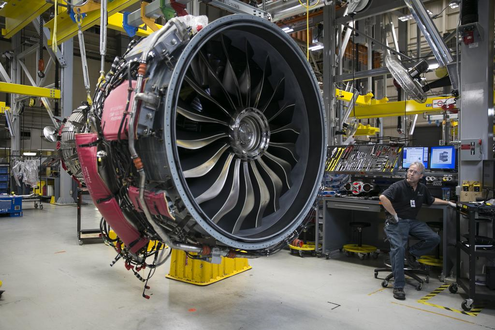

Non-Disclosure Agreement: I will only disclose non-proprietary information regarding my work at GE Aerospace. All images are public knowledge.

# Manufacturing Intern @ GE Aerospace

**_May 2024 – August 2024 | May 2025 – August 2025_**

## Overview
During my summer internships at GE Aerospace, I worked closely with both the braze operations team and manufacturing engineering on nickel-based superalloy nozzle components. A big part of my role involved improving process reliability and supporting production efficiency on the shop floor.

I conducted 5S studies on vacuum furnace operations to improve organization and workflow, and I designed mobile temperature uniformity survey racks used for furnace audits—helping ensure consistent braze quality and heat treatment performance.

  

During my second summer, I transitioned more into a manufacturing engineering role where I designed over a dozen soft fixtures for production use. These fixtures were used for daily dimensional audits, helping reduce operator fatigue while also improving consistency and first-time yield.

I also took on more ownership by pre-dispositioning tagged parts and helping design a FIFO-based flow system to better manage them through the process. Along the way, I continued developing my design engineering skills, including completing a multi-week GD&T training course designed for rotational engineers.

## Top Skills Utilized

- Fixturing  
- GD&T  
- Lean Manufacturing  

[Back to Portfolio](README.md)
